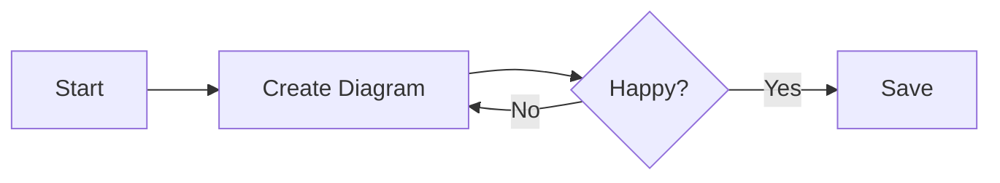

# Welcome to Graphi!

Graphi is a **local-first** application for creating beautiful architecture diagrams and flowcharts effortlessly.

## Creating Your First Diagram

To create a diagram, just type Mermaid code into the editor on the left pane.
 The canvas on the right will instantly preview your results. This is test if it saves

